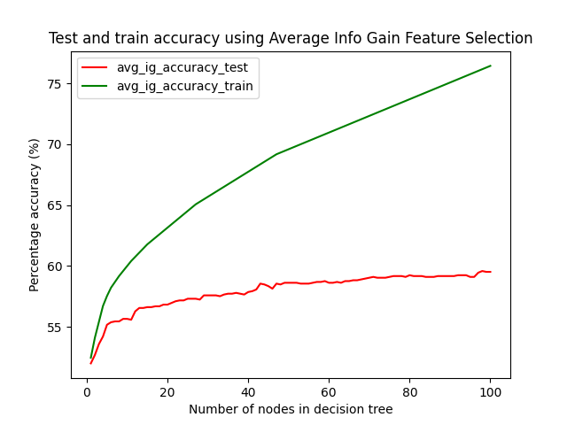
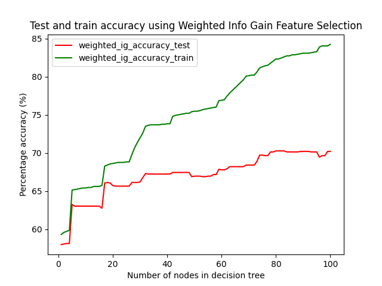

# Machine Learning Projects

1. [Supervised Learning](#supervised-learning)
    * [Decision Tree](#decision-tree)

## Supervised Learning
#### Text Categorization

The dataset consists of a set of Reddit posts sourced from https://files.pushshift.io/reddit/. 
The dataset includes a subset of 1500 comments the r/books and r/atheism subreddits, cleaned by removing 
punctuation and some offensive language, and limiting the words to only those used more than 3 times among all posts.
These 3000 comments are split evenly into training and testing sets (with 1500 documents in each). 

The goal of the classifier is to categorize the posts/documents into either 1 = `atheism` or 2 = `books` based on
the pre-processed set of words from that post/document given as input to the classifier.

`trainData.txt`: Each line follows the format `documentId wordId`. The file contains the training data for building the decision tree.

`trainLabel.txt`: The `ith` line contains the category of the `ith` document (1 = `atheism`, 2 = `books`). The file is used for building the decision tree.

`testData.txt`: Each line follows the format `documentId wordId`. The file contains the testing data to assess the accuracy of the decision tree.
 
 `testLabel.txt`: The `ith` line contains the category of the `ith` document (1 = `atheism`, 2 = `books`). The file is used to assess the accuracy of the decision tree.

### Decision Tree

Decision tree algorithms are implemented using 2 methods:

1. Average information gain

$$ I = I(E) - [ (1/2) * I(E_1) + (1/2) * I(E_2) ] $$

2. Information gain weighted by fraction of documents on each side of the split

$$ I = I(E) - [ (N_1/N) * I(E_1) + (N_2/N) * I(E_2) ] $$

where $E$ (size $N$) is the dataset at a node, $E_1$ (size $N_1$) is the subset of the dataset with feature `F`,
$E_2$ (size $N_2$) is the subset of the dataset without feature `F` 
and $I$ is the information gain from splitting the node over feature `F`.

At each step, we choose to split the leaf with the highest information gain for its next best feature to split on.
The next best feature to split on is the feature which provides the highest information gain.

We assess the accuracy of the decision trees for the two methods of information gain calculation, 
for different number of nodes in the tree.

